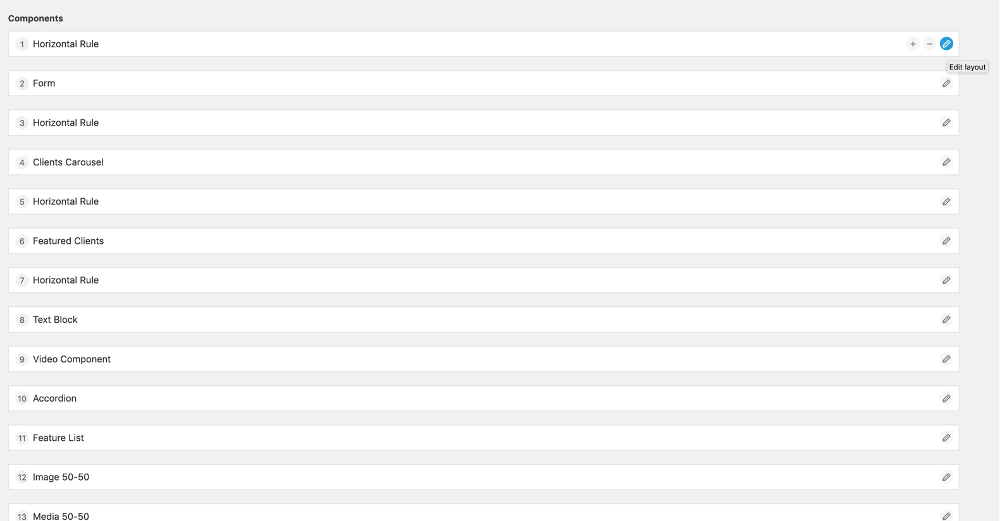
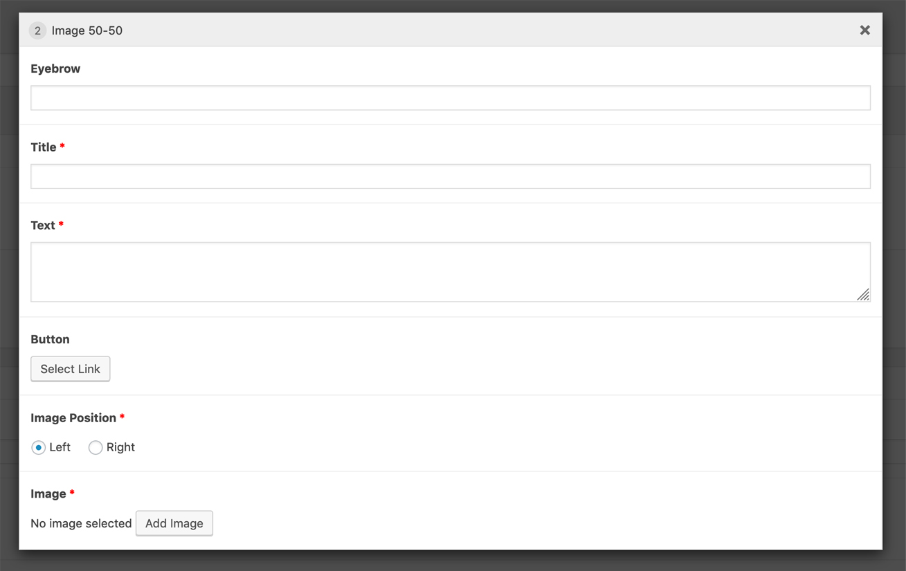
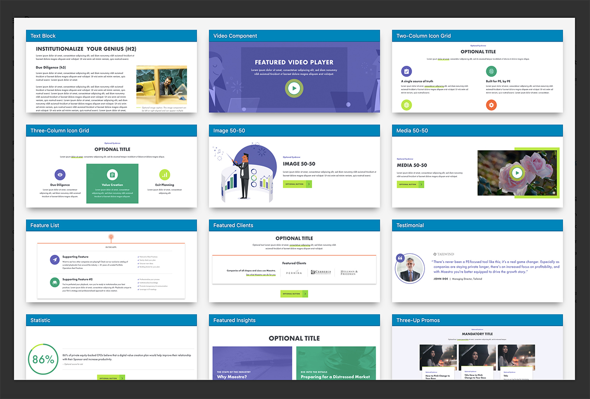

[](#)

# Flexible Content Extended for Advanced Custom Fields

> Extends the ACF Flexible Content Field by transforming the layout list into a modal with image previews. Editing the fields layouts also happens in a modal for a better editing user experience.

## Editing Layouts

The button to collapse the layouts are changed to an edit button (pencil icon). When you click the edit button or double click the layout, the layout's field will be opened in a modal window.

#### Screenshot of Flexible Content Field Layouts
[](#)


#### Screenshot of Flexible Content Field Layout Edit Modal
[](#)

## Image Previews

[](#)

### Image Conventions

* The size of the image should be 732 x 300.
* They should be named based on the layout's name (`text_block`) with underscores converted to dashes (`text-block.jpg`).

### Image Location

Images should be placed in your theme. By default, images are located here: `THEME/lib/admin/images/acf-flexible-content-extended`.

Also note that you can filter this path, but it **MUST** be in your theme:

```php
add_filter( 'acf-flexible-content-extended.images_path', $path );
```

**NOTE:** The path should not have a trailing beginning or trailing slash!

Additionally, you could filter all keys and/or images:

```php
add_filter( 'acf-flexible-content-extended.images', $images );
```

## Requirements

- [ACF Pro >= 5.7.0](https://www.advancedcustomfields.com/)
- WordPress 4.7+ because of [get_theme_file_uri()](https://developer.wordpress.org/reference/functions/get_theme_file_uri)
- Browser Support:
  - Last 2 Firefox major versions
  - Last 2 Safari major versions
  - Last 2 Edge major versions
  - Last 2 Chrome major versions
- PHP 5.6+


---


## Installation

#### [Composer](http://composer.rarst.net/)

1. Add repository source : `{ "type": "vcs", "url": "https://github.com/jameelmoses/acf-flexible-content-extended" }`.
2. Include `"acf-flexible-content-extended": "dev-master"` in your composer file for the latest master's commits or a tag released.
3. Then add your layout images.


---


### Contributing

Please refer to the [contributing guidelines](.github/CONTRIBUTING.md) to increase the chance of your pull request to be merged and/or receive the best support for your issue.

### Issues & Feature Requests

If you identify any errors or have an idea for improving the plugin, feel free to open an [issue](../../issues/new) or [create a pull request](../../compare). Please provide as much info as needed in order to help me resolving / approve your request.

### License

Flexible Content Extended for Advanced Custom Fields is licensed under the [GPLv3 or later](LICENSE.md).
